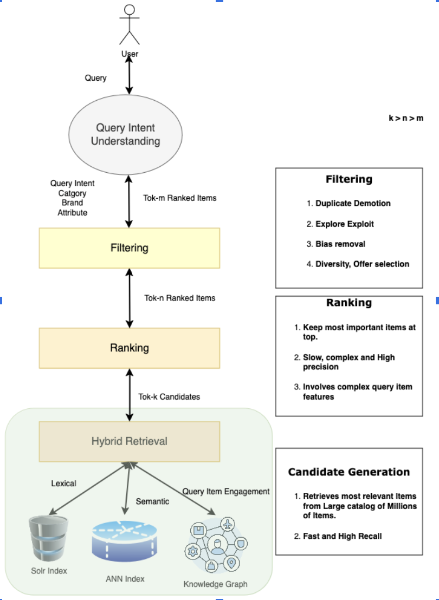
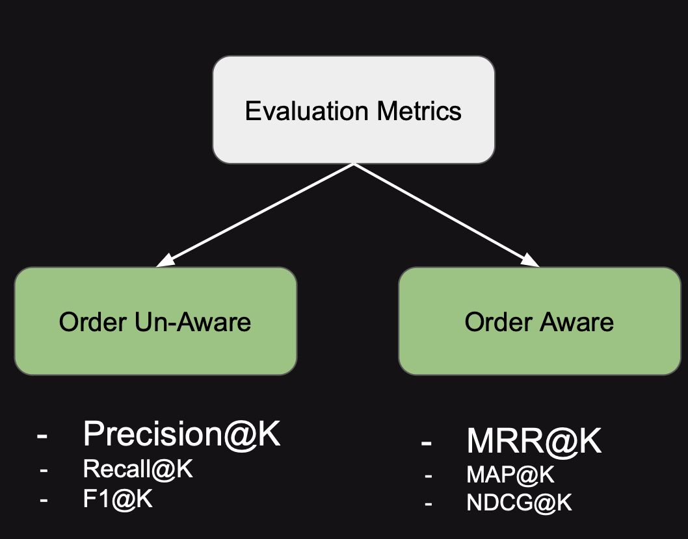

# building-semantic-retrieval-for-product-search-av
Building semantic retrieval using bi-encoder and cross-encoder on custom dataset (product-search)

## Search Architecture

## Eval Metrics
| **Approach**                                       | Precision@5 | MRR@15   |
|----------------------------------------------------|-------------|----------|
| BM25                                               | 0.705       | 0.25     |
| Baseline Bi-Encoder                                | 0.716       | 0.26     |
| Fine-tuned Bi-Encoder                              | 0.734       | 0.27     |
| Fine-Tuned Bi-Encoder + Baseline Cross-Encoder     | 0.737       | 0.27     |
| _Fine-Tuned Bi-Encoder + Fine-tuned Cross-Encoder_ | **0.796**   | **0.29** |

